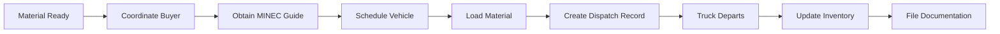

The Dispatch Management module records all outbound shipments of used vegetable oil from your collection centers to buyers, processors, or other destinations. It provides complete shipment tracking and compliance documentation.

## Overview

Dispatches represent the "exit" side of your AVU business:

- **Collection Tickets** = Entrada (material coming IN from generators)
- **Dispatches** = Salida (material going OUT to processors/buyers)

The system tracks:
- Volume dispatched
- Destination information
- Vehicle and driver details
- Government permits and guide numbers
- Material description and presentation

## Dispatch Information

Each dispatch record contains:

<CardGroup cols={2}>
  <Card title="Shipment Details" icon="truck">
    - Date of dispatch
    - Description of material
    - Presentation/packaging format
    - Quantity in liters
  </Card>
  <Card title="Destination" icon="location-dot">
    - Company name (Razón Social)
    - RIF (tax ID)
    - Physical address
  </Card>
  <Card title="Transportation" icon="id-card">
    - Vehicle (plate, brand, model)
    - Driver name
    - Driver ID (Cédula)
  </Card>
  <Card title="Compliance" icon="file-certificate">
    - MINEC guide number
    - Sorting and filtering
  </Card>
</CardGroup>

## Creating a New Dispatch

Use the form at the top of the Salidas (Dispatches) page:

<Steps>
  <Step title="Specify Date and Material">
    Enter the shipment basics:
    - **Fecha**: Date of dispatch (date picker)
    - **Descripción**: Material description (e.g., "Aceite Vegetal Usado procesado")
    - **Presentación**: Packaging format (e.g., "Tambores 200L", "IBC 1000L", "Granel")
  </Step>
  
  <Step title="Enter Quantity">
    - **Cantidad despacho (lt)**: Volume being shipped in liters
  </Step>
  
  <Step title="Document Destination">
    Record where the material is going:
    - **Destino Razón Social**: Buyer's company name
    - **Destino RIF**: Buyer's tax identification
    - **Destino Dirección**: Buyer's physical address
  </Step>
  
  <Step title="Assign Transportation">
    Select or enter vehicle and driver:
    - **Vehiculo**: Choose from registered fleet (optional)
    - **Nombre Chofer**: Driver's full name
    - **Cedula**: Driver's ID number
  </Step>
  
  <Step title="Add Compliance Info">
    - **Numero Guia MINEC**: Ministry of Environment guide/permit number
  </Step>
  
  <Step title="Save Dispatch">
    Click "Agregar" to create the dispatch record
  </Step>
</Steps>

<Note>
Vehicle selection is optional. If no vehicle is selected, you can still create the dispatch. Vehicle brand, model, and plate can be entered manually or pulled from your fleet registry.
</Note>

## Dispatch Table Fields

| Column | Description | Sortable |
|--------|-------------|----------|
| **Fecha** | Dispatch date | ✓ |
| **Descripción** | Material description | ✓ |
| **Presentación** | Packaging format | ✓ |
| **Cantidad (lt)** | Volume in liters | ✓ |
| **Destino Razón Social** | Buyer company name | ✓ |
| **Destino RIF** | Buyer tax ID | ✓ |
| **Destino Dirección** | Buyer address | ✓ |
| **Marca** | Vehicle brand | ✓ |
| **Modelo** | Vehicle model | ✓ |
| **Placa** | Vehicle plate | ✓ |
| **Nombre Chofer** | Driver name | ✓ |
| **Cedula** | Driver ID | ✓ |
| **Numero Guia MINEC** | Permit number | ✓ |
| **Acciones** | Edit/Delete buttons | - |

## Editing Dispatches

To modify an existing dispatch:

1. Click the **Edit** icon (pencil) in the Actions column
2. Dispatch data populates the form fields
3. Make your changes
4. Click **Guardar** (Save) to confirm
5. Click **Cancelar** (Cancel) to discard changes

<Warning>
Editing dispatch volumes affects dashboard analytics and Book of Control reports. Ensure accuracy before saving changes.
</Warning>

## Deleting Dispatches

<Warning>
Deleting a dispatch is **irreversible** and removes it from all reports, analytics, and the Book of Control.
</Warning>

To delete:

1. Click the **Trash** icon (red) in Actions column
2. Confirm the deletion warning
3. Dispatch is permanently removed

## Material Presentation Formats

Common presentation types:

### Tambores (Drums)
- Standard 200-liter drums
- Most common for medium-volume shipments
- Example: "Tambores 200L" or "10 tambores"

### IBC Totes
- Intermediate Bulk Containers
- Typically 1000 liters each
- Example: "IBC 1000L" or "5 IBC"

### Granel (Bulk)
- Direct tanker truck loading
- Large volume shipments
- No intermediate containers

### A Granel en Camión
- Bulk in truck tank
- Specify truck capacity
- Example: "Granel - Camión 10,000L"

<Tip>
Be specific about presentation format. This information is critical for the buyer's receiving department and for environmental compliance reporting.
</Tip>

## MINEC Guide Numbers

The **Numero Guia MINEC** field records:

- Official transport permit numbers from Ministry of Environment
- Required for legal interstate or international transport
- Links dispatch to government compliance system
- Critical for audits and environmental reporting

<Note>
MINEC = Ministerio del Poder Popular para Ecosocialismo (Ministry of Environment). Always obtain and document guide numbers for shipments requiring permits.
</Note>

## Vehicle Assignment

Dispatches can reference vehicles in two ways:

### Option 1: Select from Fleet
- Choose a registered vehicle from the dropdown
- System automatically fills brand, model, and plate
- Recommended for company-owned vehicles

### Option 2: Manual Entry
- Leave vehicle selection empty
- System uses plate number from historical data or manual entry
- Useful for contracted carriers or third-party logistics

## Dispatch Analytics

Dispatches affect:

### Dashboard Metrics
- **Total Dispatched**: Cumulative liters shipped out
- **Chart Visualization**: Orange "Salida" line shows outbound volume over time
- Appears only when viewing all generators (no filter applied)

### Book of Control
- **FOLIO 03**: Bitácora de Salidas (Dispatch Log)
- Lists all dispatches for the selected month
- Shows destination, volume, vehicle, and driver
- Includes total dispatched for the period

### Inventory Calculation
```
Current Inventory = Total Collected - Total Dispatched
```

## Sorting and Filtering

The dispatch table supports comprehensive sorting:

### Sort by Any Column
- Click column header to sort
- Click again to reverse direction
- Visual indicators:
  - ⬆️ Ascending
  - ⬇️ Descending  
  - ↕️ Available to sort

### Useful Sorts
- **By Date**: Chronological dispatch order
- **By Quantity**: Identify largest shipments
- **By Destination**: Group by buyer
- **By Driver**: Track driver assignments
- **By Placa**: Vehicle utilization analysis

## Destination Management

### Regular Buyers
For frequent destinations, consider:
- Keeping a reference document with buyer details
- Copy-paste RIF and addresses for consistency
- Create naming conventions (e.g., always "PROCESADORA CARABOBO C.A.")

### New Buyers
For first-time destinations:
- Verify RIF format (e.g., J-12345678-9)
- Confirm complete address including city/state
- Double-check contact information

<Tip>
Maintain consistency in buyer names. Always use "EMPRESA XYZ C.A." not "Empresa XYZ CA" or "EMPRESA XYZ, C.A." to ensure accurate reporting and analytics.
</Tip>

## Driver Documentation

The driver fields support:

### Nombre Chofer (Driver Name)
- Full legal name
- First and last name
- Consistent formatting

### Cédula (ID Number)
- National ID or driver's license number
- Format varies by country (e.g., V-12345678 in Venezuela)
- Required for insurance and liability tracking

<Warning>
Accurate driver information is essential for:
- Insurance claims
- Accident investigations
- Environmental compliance
- Government audits
</Warning>

## Best Practices

<AccordionGroup>
  <Accordion title="Document dispatches immediately">
    Create dispatch records as soon as the truck leaves your facility. This ensures accurate inventory tracking and timely compliance reporting.
  </Accordion>
  
  <Accordion title="Verify MINEC guide numbers">
    Always confirm that guide numbers are entered correctly. Errors can result in compliance violations and fines.
  </Accordion>
  
  <Accordion title="Match dispatch volumes to tickets">
    Periodically reconcile total dispatched against total collected to identify inventory discrepancies.
  </Accordion>
  
  <Accordion title="Keep destination info current">
    When buyers change addresses or RIF, update all future dispatch records immediately.
  </Accordion>
  
  <Accordion title="Specify presentation clearly">
    Be explicit about container types and quantities. "15 tambores 200L" is better than just "Tambores".
  </Accordion>
</AccordionGroup>

## Dispatch Workflow



## Data Validation

The system enforces:

- ✅ **Date required**: Cannot create dispatch without date
- ✅ **Quantity required**: Must specify volume in liters
- ⚠️ **Description, presentation**: Recommended for clarity
- ⚠️ **Destination info**: Not required but essential for compliance
- ⚠️ **Driver info**: Not required but recommended for safety
- ⚠️ **MINEC guide**: Required for permitted shipments (manual enforcement)

## Related Features

- [Dashboard](/features/dashboard) - View total dispatched and outbound trends
- [History and Reporting](/features/history) - Generate Book of Control with dispatch logs
- [Vehicle Fleet Tracking](/features/vehicles) - Manage dispatch vehicles
- [Dispatches API](/api/dispatches) - Programmatic dispatch management