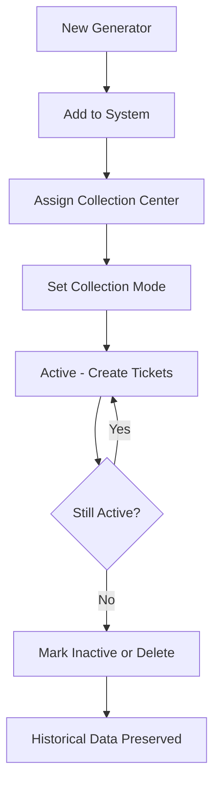

Generators are the clients who produce and provide used vegetable oil (AVU) for collection. This module allows you to manage complete client information, collection schedules, and assign generators to collection centers.

## What Are Generators?

In AVU collection operations, a "generator" is:

- A restaurant, hotel, catering business, or food establishment
- A commercial or industrial kitchen facility
- Any entity that produces used vegetable oil as a byproduct
- Your customer who requires regular or on-demand collection services

Generators are also referred to as "clients" throughout the application.

## Generator Information Management

Each generator record stores:

<CardGroup cols={2}>
  <Card title="Basic Information" icon="building">
    - Business name
    - RIF (tax identification)
    - Phone number
  </Card>
  <Card title="Location" icon="map-pin">
    - Physical address
    - Sector/neighborhood
    - Collection center assignment
  </Card>
  <Card title="Operations" icon="calendar">
    - Collection frequency
    - Collection mode schedule
  </Card>
  <Card title="Sorting & Organization" icon="arrows-up-down">
    - Sort by any field
    - Ascending/descending order
    - Filter and search
  </Card>
</CardGroup>

## Adding a New Generator

Use the input form at the top of the Generators page:

<Steps>
  <Step title="Enter Basic Information">
    Fill in the generator's details:
    - **Nombre**: Full business name
    - **RIF**: Tax identification number (format: J-12345678-9)
    - **Teléfono**: Contact phone number
  </Step>
  
  <Step title="Add Location Details">
    Specify where the generator is located:
    - **Sector**: Neighborhood or area (e.g., "Alta Vista", "El Caimito")
    - **Dirección**: Full street address
  </Step>
  
  <Step title="Set Collection Parameters">
    Configure collection logistics:
    - **Modo de recolección**: Choose frequency
      - Semanal (Weekly)
      - Quincenal (Biweekly)
      - Mensual (Monthly)
      - Fortuito (On-demand)
      - Otro (Other)
    - **Centro de Acopio**: Assign to a collection center
  </Step>
  
  <Step title="Save the Generator">
    Click the "Agregar" (Add) button to create the new generator record
  </Step>
</Steps>

<Note>
All generators must be assigned to a collection center. This determines which collectors and vehicles are available when creating tickets for this generator.
</Note>

## Generator Table Fields

| Column | Description | Sortable |
|--------|-------------|----------|
| **Nombre** | Business name | ✓ |
| **RIF** | Tax ID number | ✓ |
| **Teléfono** | Contact phone | ✓ |
| **Sector** | Neighborhood/area | ✓ |
| **Dirección** | Street address | ✓ |
| **Modo** | Collection frequency | ✓ |
| **Centro de Acopio** | Assigned collection center | ✓ |
| **Acciones** | Edit/Delete buttons | - |

## Editing Generator Information

To modify an existing generator:

1. Click the **Edit** icon (pencil) in the Actions column
2. The generator's data populates the form above
3. Make your changes in the input fields
4. Click **Guardar** (Save) to confirm
5. Click **Cancelar** (Cancel) to discard changes

<Tip>
You can edit any field except the internal ID. Changes take effect immediately and update all associated tickets automatically.
</Tip>

## Deleting Generators

<Warning>
**Deleting a generator is irreversible.** However, existing tickets referencing the generator will remain intact with cached generator name data.
</Warning>

To delete a generator:

1. Click the **Trash** icon in the Actions column
2. Confirm the deletion warning
3. The generator is permanently removed

Best practice: Only delete generators who are no longer customers. Consider marking them inactive instead if you want to preserve historical data.

## Collection Modes Explained

### Semanal (Weekly)
- Collection every 7 days
- Typical for high-volume restaurants
- Predictable scheduling

### Quincenal (Biweekly)
- Collection every 14 days
- Common for medium-volume establishments
- Balances service frequency and logistics

### Mensual (Monthly)
- Collection once per month
- Suitable for low-volume generators
- Often used for seasonal businesses

### Fortuito (On-Demand)
- Collection scheduled as needed
- Generator calls when containers are full
- Irregular schedule

### Otro (Other)
- Custom schedule not fitting standard patterns
- Use for special arrangements
- Document details in notes

## Sorting and Filtering

The generator table supports advanced sorting:

### Sorting
- Click any column header to sort by that field
- Click again to reverse sort direction (ascending ↔ descending)
- Sort indicators show current sort column and direction
- "Limpiar orden" (Clear order) button resets to default view

### Visual Indicators
- ⬆️ **ChevronUp**: Ascending sort
- ⬇️ **ChevronDown**: Descending sort
- ↕️ **ArrowUpDown**: Column is sortable (not currently sorted)

<Tip>
Sort by "Centro de Acopio" to group generators by collection center, making route planning easier.
</Tip>

## Generator Search and Filtering

On the Dashboard, use the generator filter to:

- View collection statistics for specific clients
- Generate reports for individual generators
- Analyze collection patterns by client
- Create Actas (confirmation reports) for billing

The multi-select generator dropdown supports:
- Search by name (case-insensitive)
- Multiple selection for comparison
- "Todos" option to view all generators

## Collection Center Assignment

Each generator must be assigned to a collection center. This assignment:

- Determines which staff can service the generator
- Links the generator to regional operations
- Affects ticket numbering (state code in ticket number)
- Filters available vehicles for collection

<Note>
Changing a generator's collection center does NOT change historical ticket numbers. Only new tickets will use the new center's state code.
</Note>

## Best Practices

<AccordionGroup>
  <Accordion title="Use consistent naming conventions">
    Use official business names, not colloquial names. For example, "Restaurant El Gran Cacique" not "El Cacique" or "Cacique".
  </Accordion>
  
  <Accordion title="Keep contact information current">
    Update phone numbers immediately when you learn of changes. Accurate contact info is critical for scheduling and communication.
  </Accordion>
  
  <Accordion title="Document sector clearly">
    Use recognizable sector names that drivers will understand. Examples: "Alta Vista", "C.C. Costa Granada", "Unare I".
  </Accordion>
  
  <Accordion title="Review collection modes quarterly">
    Generator production volume changes over time. Adjust collection frequency to match actual needs.
  </Accordion>
  
  <Accordion title="Assign to correct collection center">
    Match generators to the nearest or most logical collection center for efficient routing and lower fuel costs.
  </Accordion>
</AccordionGroup>

## Generator Lifecycle

## Data Validation

The system enforces:

- ✅ **Name required**: Cannot create generator without business name
- ✅ **Collection center required**: Must assign to an active center
- ⚠️ **RIF, phone, address**: Recommended but not strictly required
- ⚠️ **Sector**: Recommended for route planning
- ⚠️ **Collection mode**: Optional but helpful for scheduling

## Related Features

- [Ticket Management](/features/tickets) - Create collection tickets for generators
- [Dashboard](/features/dashboard) - Filter analytics by generator
- [History and Reporting](/features/history) - View generator collection history
- [Collection Centers](/api/collection-centers) - Manage center assignments
- [Generators API](/api/generators) - Programmatic generator management