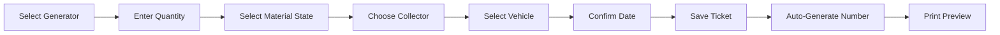

Tickets are the core operational documents in the AVU collection system. Each ticket represents a single collection event, capturing all required information for traceability, compliance, and billing.

## What Are Collection Tickets?

A collection ticket is an official document that records:

- The generator (client) from whom material was collected
- The quantity of AVU collected (in liters)
- The material state (Filtrado, Bruto, or Mezcla)
- The collector who performed the pickup
- The vehicle used for collection
- The date and location of collection

Tickets serve as legal proof of service, support environmental compliance reporting, and enable accurate billing and inventory tracking.

## Automatic Ticket Numbering

Every ticket receives a unique, sequential number following the format:

```
AV-[STATE]-[YEAR]-####
```

**Example**: `AV-ARAGUA-2026-0042`

Where:
- **AV**: Company prefix (Alternativa Verde)
- **STATE**: State code from the collection center (e.g., ARAGUA, CARABOBO)
- **YEAR**: Four-digit year
- **####**: Sequential number starting from 0001 each year

<Note>
Ticket numbers are generated automatically when you save a ticket. You'll see a preview of the expected number on the form, but the final number is assigned by the system to ensure uniqueness.
</Note>

## Creating a New Ticket

Navigate to **Nuevo Ticket** from the dashboard or main menu.

<Steps>
  <Step title="Select Generator">
    Choose the client/generator from the dropdown list. Generators are sorted alphabetically and show their sector for easy identification.
    
    **Field**: "Seleccionar Cliente / Generador"
  </Step>
  
  <Step title="Enter Load Details">
    Fill in the collection information:
    
    - **Cantidad Recolectada**: Volume in liters (decimals accepted, e.g., 150.5)
    - **Estado del Material**: Choose one:
      - **Filtrado**: Filtered, clean oil
      - **Bruto**: Raw, unfiltered oil
      - **Mezcla**: Mixed quality
  </Step>
  
  <Step title="Specify Logistics">
    Select the collection crew and vehicle:
    
    - **Recolector**: The staff member who performed the collection
    - **Vehiculo**: The vehicle used (automatically defaults to your primary vehicle)
    - **Fecha de Recolección**: Date of pickup (defaults to today)
  </Step>
  
  <Step title="Save and Print">
    Click "Guardar y Ver Ticket" to create the ticket and open the print preview
  </Step>
</Steps>

## Ticket Form Fields

### Generator Information

| Field | Description | Required |
|-------|-------------|----------|
| Seleccionar Cliente / Generador | Dropdown of all active generators | Yes |

### Load Information

| Field | Description | Required |
|-------|-------------|----------|
| Código de Ticket | Auto-generated ticket number | Auto |
| Tipo de Material | Fixed: "Aceite Vegetal Usado (AVU) - No Peligroso" | Auto |
| Cantidad Recolectada (Litros) | Volume collected, accepts decimals | Yes |
| Estado del Material | Radio buttons: Filtrado, Bruto, Mezcla | Yes |

### Logistics Information

| Field | Description | Required |
|-------|-------------|----------|
| Recolector | Staff member from active collection center | Yes |
| Vehiculo | Fleet vehicle or manual plate entry | Yes |
| Fecha de Recolección | Date picker, defaults to today | Yes |

<Warning>
You must configure an active collection center in Settings before creating tickets. The collector list is pulled from the active center's staff roster.
</Warning>

## Material States Explained

### Filtrado (Filtered)
- Clean, pre-filtered oil
- Free from food particles and sediment
- Ready for processing with minimal preparation
- Highest quality rating

### Bruto (Raw)
- Unfiltered oil straight from fryer/container
- May contain food particles and sediment
- Requires filtering before processing
- Most common state for small restaurant collections

### Mezcla (Mixed)
- Combination of filtered and raw oil
- Variable quality within the same batch
- Common in bulk collections from large generators

<Tip>
Document the material state accurately for processing planning and quality control. This information helps the processing facility prepare appropriate equipment.
</Tip>

## Editing Tickets

To modify an existing ticket:

1. Navigate to **Historial** (History)
2. Find the ticket you want to edit
3. Click the edit icon (rotated chevron)
4. Modify the fields as needed
5. Click "Guardar y Ver Ticket" to save changes

<Note>
Editing a ticket preserves its original ticket number. The system tracks edit timestamps internally for audit purposes.
</Note>

## Printing Tickets

Tickets can be printed from multiple locations:

- **After Creation**: Automatically opens print preview
- **From Dashboard**: Click any ticket in the "Últimos Tickets" widget
- **From History**: Click the printer icon next to any ticket

The printed ticket includes:

- Company logo and information
- Unique ticket number
- Generator details (name, RIF, address, sector)
- Collection details (date, quantity, material state)
- Collector and vehicle information
- Official declaration text
- Signature blocks for generator and collector

## Deleting Tickets

<Warning>
Deleting tickets is **irreversible** and should be done with caution. Deleted tickets cannot be recovered.
</Warning>

To delete a ticket:

1. Go to **Historial**
2. Find the ticket to delete
3. Click the red delete (X) button
4. Confirm the deletion warning

The ticket is permanently removed from:
- The history view
- Dashboard statistics
- Export reports
- All analytics

## Ticket Workflow Summary



## Best Practices

<AccordionGroup>
  <Accordion title="Enter tickets immediately after collection">
    Create tickets as soon as possible after pickup to ensure accurate date/time recording and prevent data entry backlogs.
  </Accordion>
  
  <Accordion title="Verify generator information">
    Double-check that you've selected the correct generator, especially for clients with similar names or multiple locations.
  </Accordion>
  
  <Accordion title="Document material state accurately">
    The material state affects processing requirements and pricing. Be consistent in your classifications.
  </Accordion>
  
  <Accordion title="Print physical copies for signatures">
    Obtain generator signatures on printed tickets for legal compliance and dispute resolution.
  </Accordion>
</AccordionGroup>

## Validation Rules

The system enforces these validation rules:

- ✅ Generator must be selected
- ✅ Quantity must be greater than zero
- ✅ Material state must be selected
- ✅ Collector must be selected (requires active collection center)
- ✅ Vehicle must be selected or plate entered
- ✅ Collection center must be configured in app settings

## Related Features

- [Dashboard](/features/dashboard) - View recent tickets and statistics
- [History and Reporting](/features/history) - Search and export tickets
- [Generator Management](/features/generators) - Manage client information
- [Vehicle Fleet Tracking](/features/vehicles) - Configure collection vehicles
- [Tickets API](/api/tickets) - Programmatic ticket creation