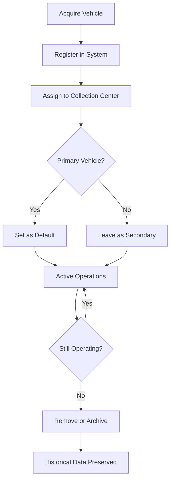

The Vehicle Fleet module tracks all vehicles used for AVU collection operations. It supports fleet management, automatic vehicle selection, and maintains complete vehicle information for documentation and compliance.

## Overview

Vehicle tracking enables:

- **Fleet Management**: Maintain records of all collection vehicles
- **Default Selection**: Automatically populate vehicle fields in ticket creation
- **Multi-Center Operations**: Assign vehicles to specific collection centers
- **Compliance Documentation**: Include vehicle details in official tickets and reports
- **Driver Assignment**: Track vehicle usage across your operation

## Vehicle Information

Each vehicle record stores:

<CardGroup cols={2}>
  <Card title="Identification" icon="id-card">
    - License plate
    - Brand/Make
    - Model
  </Card>
  <Card title="Ownership" icon="user">
    - Owner name
    - Operator assignment
  </Card>
  <Card title="Operations" icon="building">
    - Collection center assignment
    - Default vehicle flag
  </Card>
  <Card title="Organization" icon="arrows-up-down">
    - Sort by any field
    - Filter by center
    - Default vehicle indicator
  </Card>
</CardGroup>

## Adding a New Vehicle

Use the form at the top of the Vehicles page:

<Steps>
  <Step title="Enter Vehicle Details">
    Fill in the identification information:
    - **Placa**: License plate number (auto-converts to uppercase)
    - **Marca**: Vehicle brand/make (e.g., Toyota, Ford)
    - **Modelo**: Vehicle model (e.g., Hilux, F-150)
    - **Propietario**: Owner name (company or individual)
  </Step>
  
  <Step title="Assign Collection Center">
    Select which collection center operates this vehicle
  </Step>
  
  <Step title="Set Default Status">
    Check "Predeterminado" if this should be the default vehicle for its collection center
  </Step>
  
  <Step title="Save Vehicle">
    Click "Agregar" to add the vehicle to your fleet
  </Step>
</Steps>

<Note>
Only ONE vehicle per collection center can be marked as default. Setting a new default automatically clears the previous default flag.
</Note>

## Vehicle Table Fields

| Column | Description | Sortable |
|--------|-------------|----------|
| **Placa** | License plate (uppercase) | ✓ |
| **Marca** | Vehicle brand/make | ✓ |
| **Modelo** | Vehicle model | ✓ |
| **Propietario** | Owner name | ✓ |
| **Centro de Acopio** | Assigned collection center | ✓ |
| **Predeterminado** | Default vehicle indicator (⭐) | ✓ |
| **Acciones** | Edit/Delete buttons | - |

## Default Vehicle Behavior

Default vehicles streamline ticket creation:

### Automatic Selection
When creating a new ticket:
1. System checks for vehicles registered to the active collection center
2. If a default vehicle exists, it's automatically selected
3. If no default exists, the first vehicle in the list is used
4. Staff can override the selection if needed

### Setting a Default
- Only one vehicle can be default per collection center
- Mark a vehicle as "Predeterminado" when adding or editing
- System automatically clears previous default when you set a new one

### Visual Indicator
- ⭐ **Star icon**: Indicates the default vehicle
- Appears in the "Predeterminado" column
- Non-default vehicles show a dash (—)

<Tip>
Set your most frequently used or primary vehicle as default to speed up ticket creation and reduce data entry errors.
</Tip>

## Editing Vehicle Information

To modify vehicle details:

1. Click the **Edit** icon (pencil) in the Actions column
2. Vehicle data populates the form above
3. Make changes to any field
4. Update the default status if needed
5. Click **Guardar** (Save) to confirm
6. Click **Cancelar** (Cancel) to discard changes

<Warning>
Changing vehicle information does NOT update historical tickets. Existing tickets retain the plate number captured at creation time.
</Warning>

## Deleting Vehicles

<Warning>
Deleting a vehicle is **irreversible**. Existing tickets will still display the vehicle plate, but you won't be able to select this vehicle for new tickets.
</Warning>

To remove a vehicle:

1. Click the **Trash** icon (red) in Actions column
2. Confirm the deletion warning
3. Vehicle is permanently removed from the active fleet

**Impact of Deletion**:
- ✅ Historical tickets keep the vehicle plate information
- ❌ Vehicle no longer appears in dropdown menus
- ❌ Cannot be selected for new tickets
- ⚠️ If deleted vehicle was default, system picks next available vehicle

## Collection Center Assignment

Vehicles are linked to collection centers:

### Why Assign Vehicles?
- **Route Optimization**: Vehicles operate in specific regions
- **Ticket Accuracy**: Only relevant vehicles appear when creating tickets
- **Default Selection**: Each center can have its own default vehicle
- **Fleet Separation**: Keep urban and rural fleets organized

### How Assignment Works
- Vehicle dropdown in ticket creation shows only vehicles for the active collection center
- Changing the active center shows different vehicles
- Unassigned vehicles ("Sin centro") don't appear in ticket creation

<Note>
Always assign vehicles to a collection center. Unassigned vehicles require manual plate entry during ticket creation.
</Note>

## Sorting Vehicles

The vehicle table supports flexible sorting:

### Sort Options
- Click any column header to sort
- Click again to reverse direction (ascending ↔ descending)
- Visual indicators show current sort:
  - ⬆️ Ascending
  - ⬇️ Descending
  - ↕️ Sortable (not active)

### Useful Sorts
- **By Plate**: Alphabetical fleet listing
- **By Center**: Group vehicles by operational region
- **By Default**: See default vehicles first
- **By Brand/Model**: Fleet composition analysis

## Manual Plate Entry Fallback

If no vehicles are registered:

- Ticket creation form shows a text input for "Vehiculo (Placa)"
- Staff manually types the plate number
- Useful during system setup or for temporary rental vehicles
- Less efficient than using the vehicle database

<Tip>
Register all vehicles in the system (even temporary ones) to enable validation, autocomplete, and accurate reporting.
</Tip>

## Vehicle Fleet Best Practices

<AccordionGroup>
  <Accordion title="Register all vehicles immediately">
    Add new vehicles to the system before their first collection route to ensure proper documentation from day one.
  </Accordion>
  
  <Accordion title="Use consistent plate formatting">
    The system auto-converts plates to uppercase, but enter them consistently (e.g., ABC-123 or ABC123).
  </Accordion>
  
  <Accordion title="Keep one default per center">
    Maintain a single default vehicle per collection center. Use your primary or most reliable vehicle.
  </Accordion>
  
  <Accordion title="Update ownership information">
    When vehicles change hands or operators, update the "Propietario" field for insurance and liability tracking.
  </Accordion>
  
  <Accordion title="Assign vehicles to correct centers">
    Match vehicles to the collection centers they actually operate from. This ensures efficient routing and correct defaults.
  </Accordion>
  
  <Accordion title="Don't delete active vehicles">
    Only delete vehicles that are permanently out of service. For temporarily inactive vehicles, consider keeping them registered.
  </Accordion>
</AccordionGroup>

## Vehicle Lifecycle

## Vehicle Data in Reports

Vehicle information appears in:

- **Collection Tickets**: Plate number in logistics section
- **Actas (Reports)**: Vehicle details in summary reports
- **History Exports**: Vehicle column in Excel exports
- **Dispatch Records**: Vehicle tracking for outbound shipments

## Multi-Vehicle Operations

### Single Center with Multiple Vehicles
- Set one as default
- Others available in dropdown
- Staff selects appropriate vehicle per route

### Multi-Center Operations
- Each center has its own vehicle list
- Default per center ensures regional accuracy
- Prevents cross-center vehicle selection errors

## Data Validation

The system enforces:

- ✅ **Plate required**: Cannot create vehicle without license plate
- ✅ **Collection center required**: Must assign to an active center
- ✅ **Uppercase conversion**: Plates automatically converted (abc123 → ABC123)
- ⚠️ **Brand, model, owner**: Recommended but not strictly required
- ⚠️ **Unique plates**: System doesn't enforce uniqueness (manual check recommended)

## Related Features

- [Ticket Management](/features/tickets) - Vehicles are selected during ticket creation
- [Dispatch Management](/features/dispatches) - Track outbound shipments by vehicle
- [Collection Centers](/api/collection-centers) - Configure center-vehicle assignments
- [Vehicles API](/api/vehicles) - Programmatic fleet management